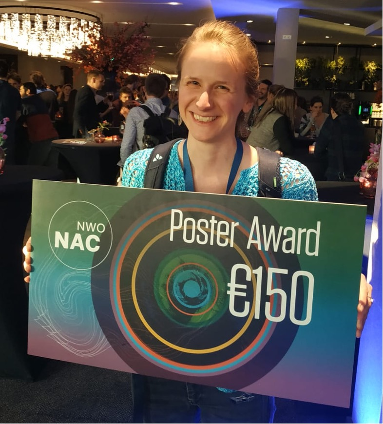

I won a poster award at NAC (Dutch Earth Science Conference)! You can view the poster [here](./poster.pdf). You might recognise the design from somewhere... 😊 <!--truncate--> Thanks to [Tom Kra](https://tomkra.dev) for making an amazing website design inspired by this poster! 

It seems the [Visualize your Science](https://www.visualizeyourscience.com) course really paid off for me! Big thanks to all the course instructors and my peers for all their feedback and the amazing training, and to the organisers of NAC for a great conference and for awarding me the prize.

