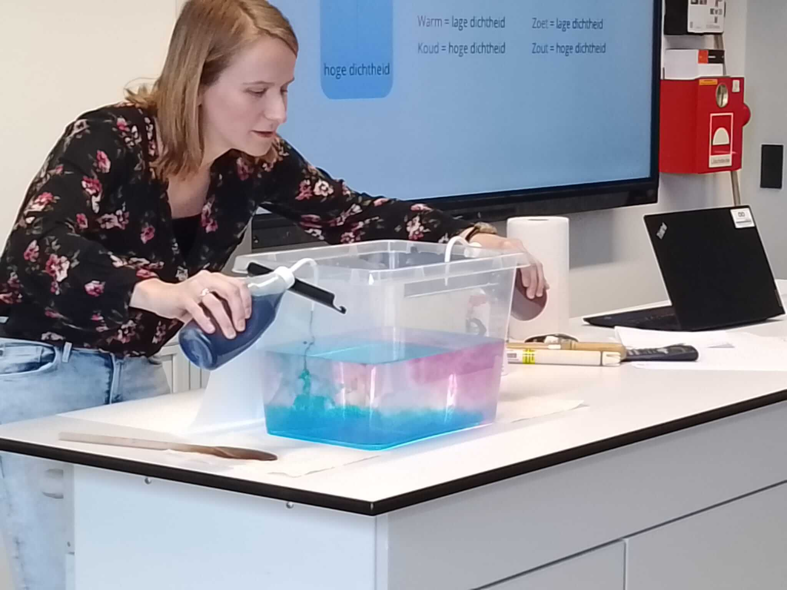

## High school lectures 🇬🇧

I regularly give talks or guest lectures for high school students about physical oceanography and my work as a researcher. I always enjoy the natural curiosity and the critical and inspiring questions that young students ask. If the setup allows I do a live demonstration of the effects of salt and temperature on density of water and density-driven ocean currents using simple tools (a large plastic container, food coloring liquid, and kitchen salt). Furthermore I talk about seagoing research and my experiences on two scientific cruises, to highlight how much time and effort actually goes into measurements of the ocean, and how special an environment the ocean is to do research in.

&nbsp;
&nbsp;

## Gastlessen voor scholieren 🇳🇱

Ik geef regelmatig praatjes of gastlessen voor middelbare scholieren over fysische oceanografie en mijn werk als onderzoeker. Ik geniet altijd van de nieuwsgierigheid en de kritische en inspirerende vragen van leerlingen. Als het mogelijk is geef ik een demonstratiepracticum over de effecten van zout en temperatuur op de dichtheid van water en de dichtheidsgedreven oceaancirculatie met behulp van huis-, tuin- en keukenmateriaal (een grote plastic bak, voedselkleurstof en keukenzout). Daarnaast vertel ik over zeegaand onderzoek en mijn ervaringen op twee wetenschappelijke vaartochten, om te benadrukken hoeveel tijd en moeite er zit in het verkrijgen van metingen van de oceaan, en hoe bijzonder de oceaan is als onderzoeksomgeving.

Voor mogelijkheden voor gastlessen, neem gerust [contact](contact) met me op!

&nbsp;
&nbsp;

&nbsp;
&nbsp;

<iframe width="100%" height="315" src="https://www.youtube.com/embed/0KwDSIabhew?si=Ri5WVBxfk8qVb_aR" title="YouTube video player" frameborder="0" allow="accelerometer; autoplay; clipboard-write; encrypted-media; gyroscope; picture-in-picture; web-share" referrerpolicy="strict-origin-when-cross-origin" allowfullscreen></iframe>
